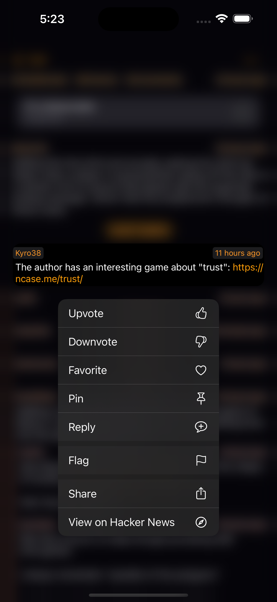
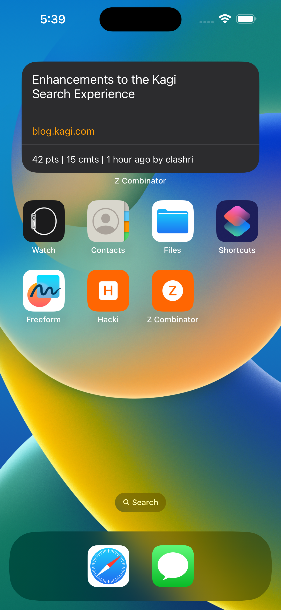
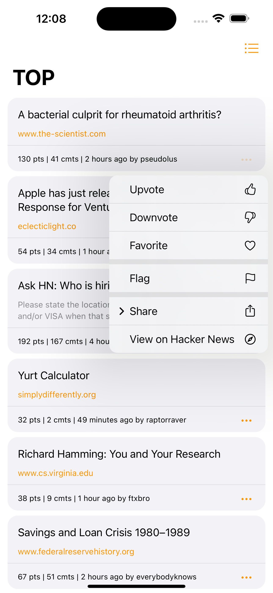
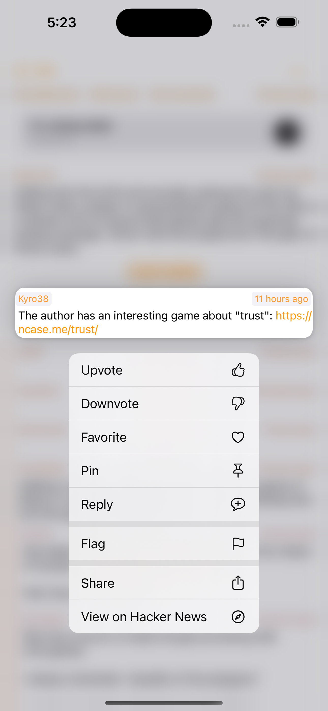
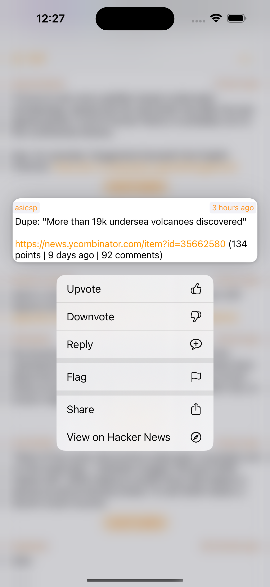
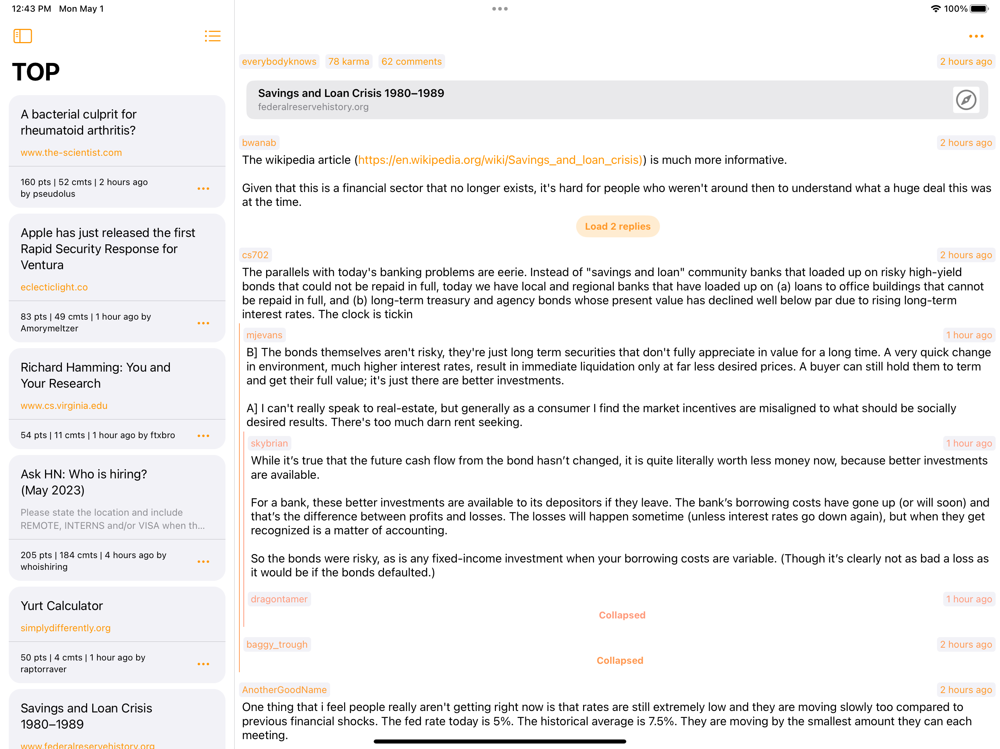

#  ZCombinator for Hacker News

Another [Hacker News](https://news.ycombinator.com/) client made with SwiftUI.

Features:
- Log in using Hacker News account
- Reply to stories/comments
- Vote on stories/comments
- Add stories/comments to your HN favorites
- Collapse threads

  
   
  
  
  
  
  
  
  
  
  
   

