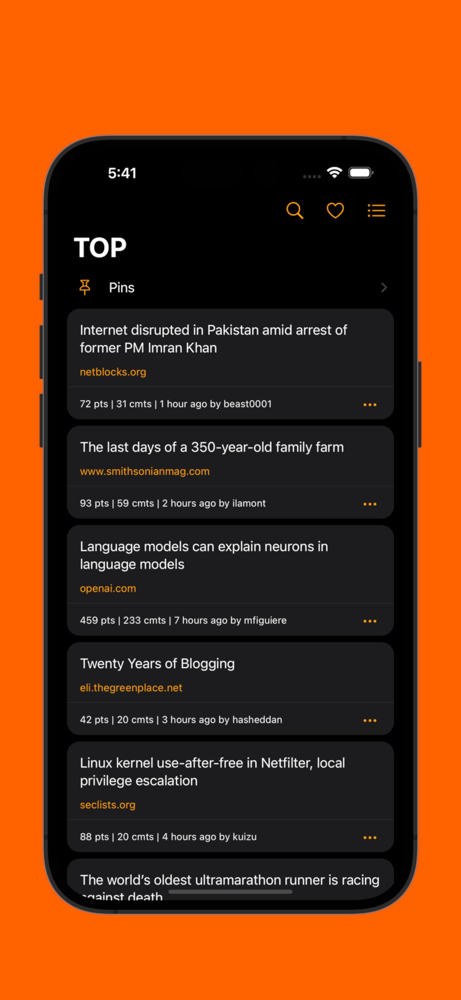
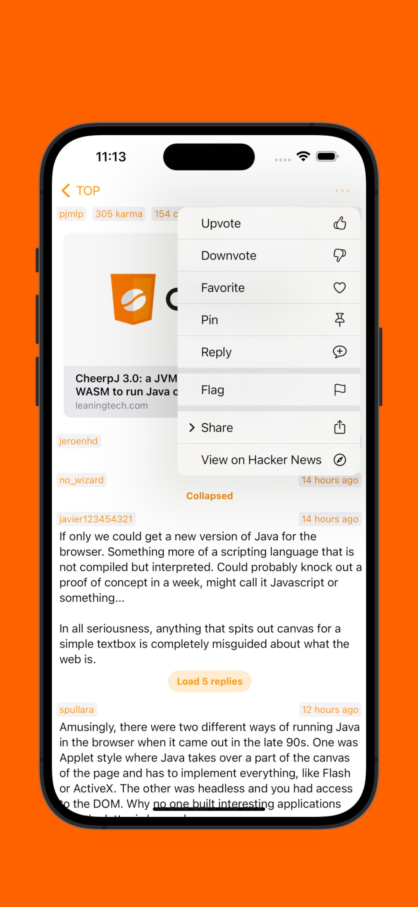
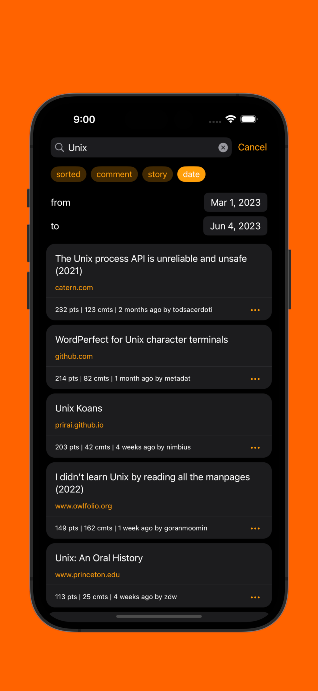
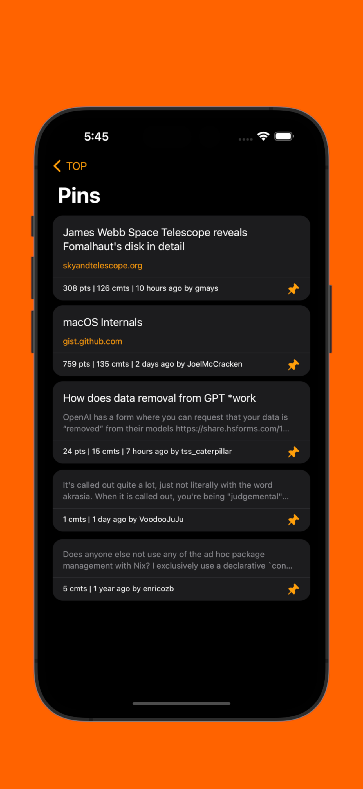
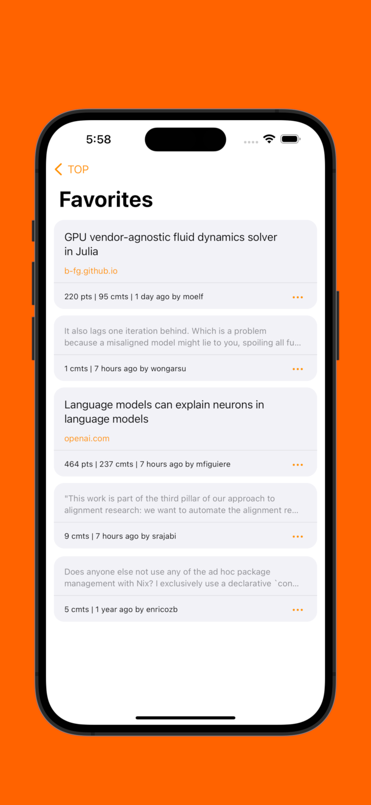
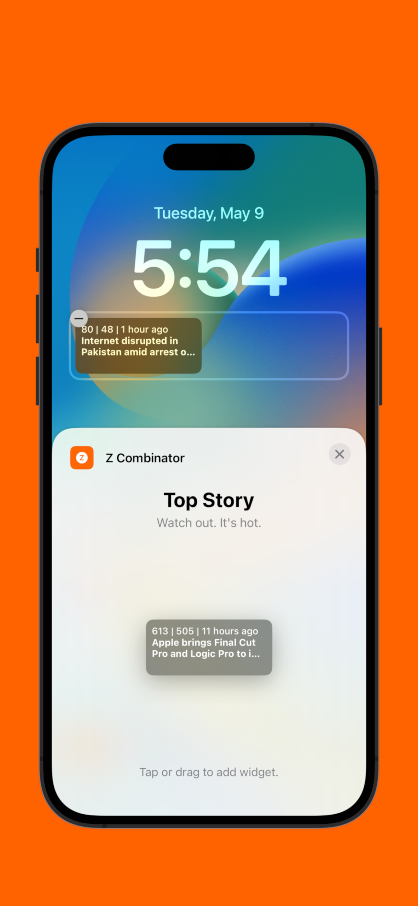

#  Z Combinator for Hacker News

Another [Hacker News](https://news.ycombinator.com/) client made with SwiftUI.

- [x] Log in using Hacker News account.
- [x] Reply to stories/comments.
- [x] Vote on stories/comments.
- [x] Add stories/comments to your pins or HN favorites.
- [x] View other users' profiles and submissions.
- [x] Comment folding.
- [x] Home Screen and Lock Screen widget.
- [x] Share Extension.
- [x] Action Extension.

  
  
  

  
  
  

  
  
  

  
  
  

